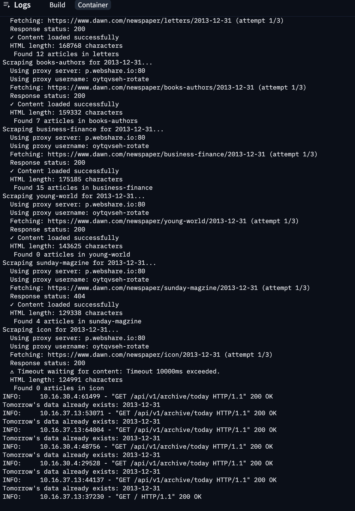

# Dawn News Archive

This site is inspired from [forty.news](https://forty.news/), it shows news from the same day forty years ago. I found this really interesting, it offers a perspective on where we were, where we are now, and whether things actually changed.

# How It Works

- Every night at midnight, a GitHub Actions workflow triggers a scraping endpoint
- The API fetches all news for today’s date, precomputes data for tomorrow, stores it for instant access, and cleans up outdated files
- All scraping traffic is routed through webshare.io to avoid bot detection

# Demo

# Production Logs

